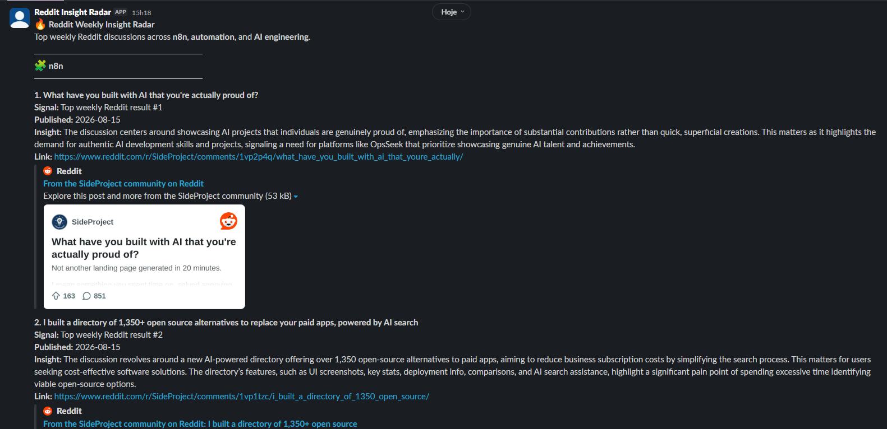

# Reddit Insight Radar

      

Weekly research intelligence automation that discovers, ranks, contextualizes, and delivers **high-signal Reddit discussions** across selected technical topics directly to Slack.

Reddit Insight Radar is designed to reduce the manual work involved in continuously monitoring online communities.

Instead of repeatedly searching Reddit, reviewing dozens of posts, removing irrelevant results, comparing discussions, and organizing findings, the workflow automatically builds a curated weekly digest of conversations worth investigating further.

Each weekly execution selects **4 posts per topic**, producing a final digest of up to **12 curated discussions**.

This configuration is intentionally adjustable and can be expanded to support larger teams, broader research scopes, or additional monitored topics.

## Problem

Reddit can be a valuable source of technical discussions, community pain points, emerging ideas, and market signals.

However, using it consistently for research creates a repetitive operational workflow.

A professional monitoring several topics manually needs to:

- search each topic individually;
- review dozens of candidate posts;
- distinguish relevant discussions from loosely related results;
- compare posts across different searches;
- identify duplicated discussions;
- read enough context to understand what each post is about;
- decide which conversations deserve deeper investigation;
- organize and share useful findings;
- repeat the process every week.

Reddit's own weekly search position is also not enough to determine whether a discussion is highly relevant to a specific research topic.

The result is a time-consuming research process with a high signal-to-noise ratio.

## Solution

I built Reddit Insight Radar as a reusable research automation pipeline that transforms Reddit's weekly discussion feed into a compact Slack digest.

The workflow:

1. runs automatically on a weekly schedule;
2. generates a dynamic queue of configured research topics;
3. retrieves weekly Reddit discussions through RSS;
4. processes topic requests sequentially with controlled delays;
5. removes RSS entries that are not actual Reddit discussion posts;
6. normalizes candidate post data into a consistent internal schema;
7. scores each candidate according to topical relevance;
8. combines relevance with its position in Reddit's weekly results;
9. prevents the same discussion from being selected across multiple topics whenever sufficient unique candidates exist;
10. selects the top 4 posts for each topic;
11. generates a concise AI-assisted insight for every selected discussion;
12. formats and sends the final research digest to Slack.

The AI layer is intentionally applied **after rule-based filtering, relevance scoring, ranking, and duplicate control**.

The workflow uses explicit scoring and selection rules to identify which discussions should move forward. The AI is then used as an interpretation layer, adding concise context to help the user understand the relevance and potential value of each selected post.



<p align="center">
  <em><strong>Figure 1.</strong> Weekly Slack digest containing curated Reddit discussions, research signals, AI-assisted context, and direct links to the original posts.</em>
</p>

## Architecture

```text
                        Reddit Insight Radar
                                |
                                v
                         Schedule Trigger
                                |
                                v
                     Workflow Configuration
                                |
                                v
                       Build Topic Queue
                                |
                                v
                       Loop Over Topics
                        batch size: 1
                                |
                                v
                         Reddit RSS Read
                                |
                                v
                        Filter Valid Posts
                                |
                                v
                       Normalize Post Data
                                |
                                v
                         Controlled Wait
                                |
                    +-----------+-----------+
                    |                       |
                    | next topic            |
                    +-----------------------+
                                |
                           loop complete
                                |
                                v
                      Relevance Scoring
                                |
                                v
                         Final Ranking
                                |
                                v
                        URL Deduplication
                                |
                                v
                     Top 4 Posts per Topic
                                |
                                v
                          OpenAI API
                                |
                                v
                    Concise Research Insight
                                |
                                v
                      Slack Message Formatter
                                |
                                v
                           Slack API
                                |
                                v
                     Weekly Research Digest
```

## How It Works

### 1. Centralized workflow configuration

Operational parameters are stored in a dedicated configuration node instead of being duplicated throughout the workflow.

The current configuration includes:

```text
timeframe: week
limit: 30
top_per_topic: 4
total_results: 12
slack_channel: #reddit-insights
```

Each topic retrieves up to **30 weekly candidates** before filtering and ranking.

Centralized configuration keeps operational parameters and topic expansion separate from the processing logic.

### 2. Dynamic topic queue

The workflow creates one processing item for every monitored topic.

Each topic contains:

```text
topic
search query
RSS URL
shared configuration
```

The current queue contains:

```text
n8n
Automation
AI Engineering
```

Adding or modifying research topics does not require creating separate duplicated workflow branches.

### 3. Sequential Reddit collection

The workflow retrieves Reddit's weekly search feed through RSS using:

```text
sort=top
t=week
limit=30
```

Topics are processed one at a time with a controlled delay between requests.

```text
Topic
  |
  v
RSS Request
  |
  v
Processing
  |
  v
Controlled Wait
  |
  v
Next Topic
```

This keeps Reddit collection predictable while reducing unnecessary request pressure.

### 4. Post filtering and normalization

RSS feeds can contain entries that are not individual Reddit discussions.

The workflow validates URLs and only allows entries matching the expected Reddit `/comments/` structure to continue.

Valid posts are transformed into a predictable internal object containing fields such as:

```text
topic
title
reddit_link
original_url
published_at
author
text
rss_rank
relevance_score
final_score
topic_rank
```

A consistent internal schema simplifies ranking, deduplication, AI processing, and Slack formatting downstream.

### 5. Topic relevance scoring

Reddit's weekly position is treated as a useful signal, but **not as sufficient evidence of topical relevance**.

Every candidate receives an additional relevance score based on topic-specific terminology found in its title and available text.

For example, AI Engineering may consider terms such as:

```text
AI engineer
AI engineering
RAG
LangGraph
LangChain
embeddings
LLM
vector database
OpenAI
AI agents
```

Terms appearing in the title receive stronger weighting than those appearing only in the available post text.

This allows the workflow to prioritize discussions that are more closely aligned with the intended research topic.

### 6. Ranking and duplicate control

Final ranking combines:

```text
Topic Relevance
       +
Reddit Weekly Position
```

with topical relevance receiving the stronger weight.

After ranking, Reddit URLs are normalized before selection.

The workflow removes differences caused by:

- query strings;
- trailing slashes;
- equivalent URL variations.

Previously selected URLs are tracked so that the same discussion is not assigned to multiple categories whenever enough unique candidates are available.

The target output is:

```text
4 n8n posts
4 Automation posts
4 AI Engineering posts

= 12 curated discussions
```

### 7. AI-assisted insight generation

Each selected post is sent individually to the OpenAI API.

The model receives available context including:

- topic;
- post title;
- available Reddit text;
- weekly Reddit signal;
- publication date.

It returns one concise paragraph explaining:

1. what the discussion is about;
2. why it may matter;
3. what pain point, opportunity, content idea, or market signal can be extracted.

The output is intentionally concise because its purpose is **research triage**.

The insight gives the user enough context to decide whether the original Reddit discussion deserves deeper investigation.

### 8. Controlled AI output

The AI layer follows explicit output constraints to keep each insight concise, consistent, and grounded in the available Reddit data.

The model is instructed to:

- return one concise paragraph;
- avoid headings, bullet points, and artificial report sections;
- avoid unsupported or unavailable Reddit metrics;
- use only information supplied by the workflow.

This keeps the final digest predictable and easy to scan.

### 9. Slack delivery

The final digest begins with an introductory message followed by topic sections:

```text
🔥 Reddit Weekly Insight Radar

🧩 n8n

⚙️ Automation

🤖 AI Engineering
```

Each selected discussion is delivered as an individual Slack message containing:

```text
Title

Signal: ...
Published: ...
Insight: ...
Link: ...
```

Individual delivery keeps each discussion visually isolated and allows the Reddit preview to remain associated with the correct post and insight.

Link unfurling remains enabled so the original discussion can be accessed directly from Slack.

## Reliability and Engineering Decisions

### Relevance-based ranking

Candidate selection does not rely exclusively on Reddit's weekly search position.

The workflow combines Reddit's ranking signal with topic-specific relevance scoring, giving stronger weight to topical alignment.

### Rate-limit-aware collection

Reddit RSS requests are processed sequentially with controlled delays between topics.

This keeps collection stable while avoiding unnecessary request concurrency.

### Rule-based selection before AI

Post selection is handled through explicit workflow logic rather than delegated to the LLM.

The workflow is responsible for:

- validating Reddit discussion URLs;
- normalizing post data;
- calculating topical relevance;
- ranking candidates;
- controlling duplicates.

The AI layer is introduced only after the final posts have been selected.

### Cross-topic duplicate protection

Related research queries may return the same discussion.

URL normalization and selected-link tracking reduce repeated recommendations across categories.

### Data integrity

The workflow uses only information available through Reddit RSS and does not infer unavailable engagement metrics.

Ranking is based on collected signals combined with topic-specific relevance scoring.

### Controlled AI interpretation

AI-generated insights are constrained to the information available for each selected discussion.

The model is used as an interpretation layer, adding concise context to help the user understand the relevance and potential value of each post.

### Centralized configuration

Topics, selection limits, scheduling parameters, and delivery settings are managed through centralized workflow configuration.

This allows the research scope to be adjusted without duplicating processing branches.

### Credential isolation

OpenAI and Slack credentials are managed through n8n's credential system.

The exported workflow does not contain:

- API keys;
- Slack tokens;
- passwords;
- manually embedded secrets.

## Output

The final product is a recurring research digest designed to help users stay close to the conversations developing in their field without continuously monitoring Reddit manually.

The workflow turns:

```text
Manual Reddit Search
        |
        v
Review Dozens of Posts
        |
        v
Filter Noise
        |
        v
Compare Discussions
        |
        v
Remove Duplicates
        |
        v
Read for Context
        |
        v
Organize Findings
```

into:

```text
Weekly Automated Research
        |
        v
Curated Discussions
        |
        v
AI-Assisted Context
        |
        v
Slack Delivery
```

The original Reddit discussion remains the source of truth.

The generated insight acts as a decision layer that helps the user determine **what deserves deeper attention**.

## Tech Stack

| Layer | Technology |
|---|---|
| Workflow orchestration | n8n |
| Scheduling | n8n Schedule Trigger |
| Research source | Reddit RSS |
| Filtering & normalization | JavaScript |
| Relevance scoring | JavaScript |
| Ranking & deduplication | JavaScript |
| AI processing | OpenAI API |
| Delivery | Slack API |
| Slack authentication | OAuth |
| Credential management | n8n Credentials |

## Repository Structure

```text
reddit-insight-radar/
│
├── workflows/
│   └── reddit-insight-radar.json
│
├── image/
│   └── slack-output.png
│
├── .gitignore
├── LICENSE
├── README.md
```

## What This Project Demonstrates

Reddit Insight Radar demonstrates:

- AI automation architecture;
- n8n workflow orchestration;
- scheduled research automation;
- dynamic queue processing;
- rate-limit-aware request handling;
- RSS integration;
- JavaScript data transformation;
- relevance scoring and multi-factor ranking;
- URL normalization and deduplication;
- controlled LLM integration;
- prompt engineering;
- Slack API integration;
- OAuth-based authentication;
- centralized workflow configuration;
- reusable workflow design.

The project demonstrates an important principle in AI automation engineering: **the LLM does not need to control the entire workflow to provide value**.

Rule-based logic handles collection, validation, ranking, and duplicate control, while the AI layer is applied where interpretation adds value — providing concise context that helps users decide which discussions deserve deeper attention.

## License

This project is licensed under the **MIT License**.
